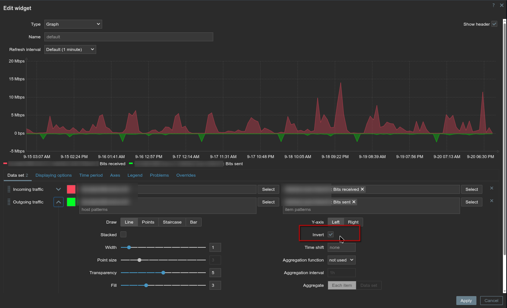

# Zabbix SVG Graph Widget: Invert Y-Axis Patch

This document provides instructions on how to apply a patch to the SVG Graph widget in Zabbix to add an "Invert Y-Axis" option.

This is useful for metrics where a lower value is better, such as response times or error rates, or for visualizing data like network traffic.

## Supported Versions

This patch is available for the following Zabbix versions:

*   v7.4.3
*   v7.4.2
*   v7.2.13
*   v7.2.12

## Installation Instructions

1.  **Identify your Zabbix version:**
    Before applying the patch, ensure you are running a compatible Zabbix version.

2.  **Choose the correct patch file:**
    Based on your Zabbix version, choose the corresponding patch file.

3.  **Navigate to the widget directory:**
    The SVG Graph widget is typically installed at the following location:

    ```bash
    /usr/share/zabbix/ui/widgets/svggraph
    ```

    You will need to have shell access to your Zabbix server to perform the next steps. The patch should be applied from the parent directory (`/usr/share/zabbix/ui/widgets/`).

4.  **Apply the patch (with backup):**
    From the parent directory (`/usr/share/zabbix/ui/widgets/`), run the `patch` command. Using the `--backup` and `--suffix` flags will save a copy of each original file with a version-specific suffix.

    **For v7.4.3:**
    ```bash
    sudo patch -p1 -d svggraph --backup --suffix=-orig-7.4.3 < /path/to/svggraph_invert_y_axis_7.4.3.patch
    ```

    **For v7.4.2:**
    ```bash
    sudo patch -p1 -d svggraph --backup --suffix=-orig-7.4.2 < /path/to/svggraph_invert_y_axis_7.4.2.patch
    ```

    **For v7.2.13:**
    ```bash
    sudo patch -p1 -d svggraph --backup --suffix=-orig-7.2.13 < /path/to/svggraph_invert_y_axis_7.2.13.patch
    ```

    **For v7.2.12:**
    ```bash
    sudo patch -p1 -d svggraph --backup --suffix=-orig-7.2.12 < /path/to/svggraph_invert_y_axis_7.2.12.patch
    ```

    **Note:** Replace `/path/to/` with the actual path to the patch file on your system.

5.  **Clear browser cache:**
    After applying the patch, you must clear your browser's cache for the changes to be visible in the Zabbix frontend.

## Reverting the Patch

To uninstall the patch, use the `-R` (or `--reverse`) option. This will revert the changes and restore the original files from the backups.

**For v7.4.3:**
```bash
sudo patch -p1 -d svggraph -R < /path/to/svggraph_invert_y_axis_7.4.3.patch
```

**For v7.4.2:**
```bash
sudo patch -p1 -d svggraph -R < /path/to/svggraph_invert_y_axis_7.4.2.patch
```

**For v7.2.13:**
```bash
sudo patch -p1 -d svggraph -R < /path/to/svggraph_invert_y_axis_7.2.13.patch
```

**For v7.2.12:**
```bash
sudo patch -p1 -d svggraph -R < /path/to/svggraph_invert_y_axis_7.2.12.patch
```

## What the Patch Does

This patch adds an "Invert" checkbox to the data set configuration in the SVG Graph widget. When this option is enabled for a data set, the Y-axis values for that data set will be displayed as negative values, effectively inverting the graph.

## Screenshot

Here is what the new "Invert" option looks like in the data set configuration:

